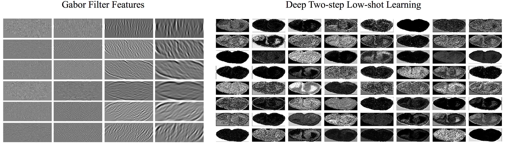
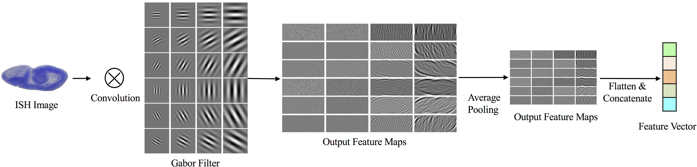

# Supplementary for Deep Low-Shot Learning for Biological Image Classification and Visualization from Limited Training Samples 

## Quantitative Analysis of Predictive Performance

In order to analyze the prediction errors of our model, we compare the confusion matrices of the prediction results, as shown in the above figure. We observe that most wrongly-predicted samples are classified into neighboring stages, within the correct stage ranges. In particular, for deep learning models trained using our proposed low-shot learning methods, the number of samples that are categorized into wrong stage ranges is fewer than the baseline. It indicates that the data-level deep low-shot learning step effectively incorporates information from samples with stage range labels and improves the performance of precise stage prediction.

## Qualitative Analysis of Predictive Performance

We compare the features extracted by Gabor filters with those generated by the first convolutional layer in the proposed model. The above figure provides visualizations of the features. Clearly, Gabor filters can only extract pre-defined low-level texture features while our deep learning model is able to extract data-driven and task-related features automatically. Our deep two-step low-shot learning framework takes advantage of the power of deep learning models by proposing effective training approaches and yields improved performance.

## Related Work

Currently, the state-of-the-art method for the precise stage prediction task of ISH images is to extract features using pre-defined convolutional filters and train a linear classifier based on the extracted features. Texture features of different scales and orientations can be computed with different filters. The filter weights are constructed by using log Gabor filters. Given a set of pre-defined wavelet scales and orientations, we can generate corresponding Gabor filters to extract the specific features by convolving on input images. The precise stage prediction model based on Gabor filter features is illustrated in the above figure.

